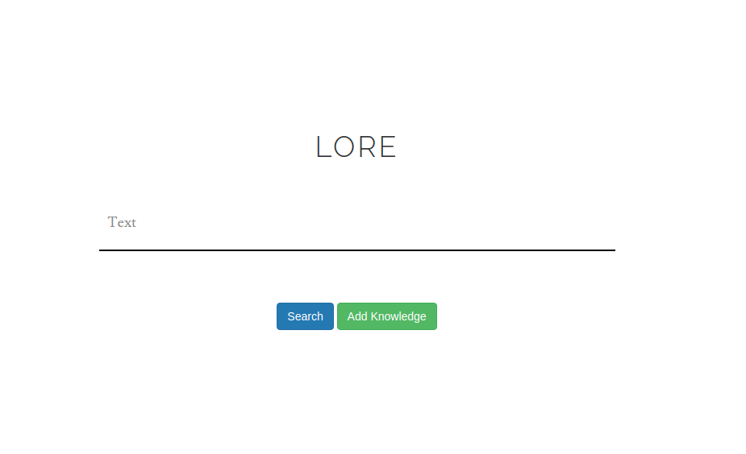

## SERVERLESS NOTEPAD

### Description
You can use it if you forget that they always take notes like me. For those repo who are tired of looking for the same things again.



### Install
 - First of all you need to have aws account 
    - You can check on terminal ```tail ~/.aws/credentials```
 - If you have AWS account create ElasticService ( you can choose micro )
 - Install chalice ```pip install chalice```

### Run
 - If you want to run on localhost:
    - ```chalice local```
 - If you want deploy to AWS:
    - ```chalice deploy```
 - If you want remove in AWS:
    - ```chalice delete```
   